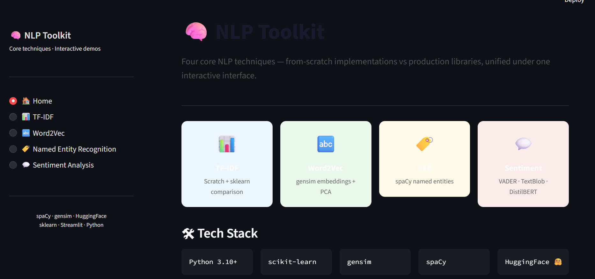
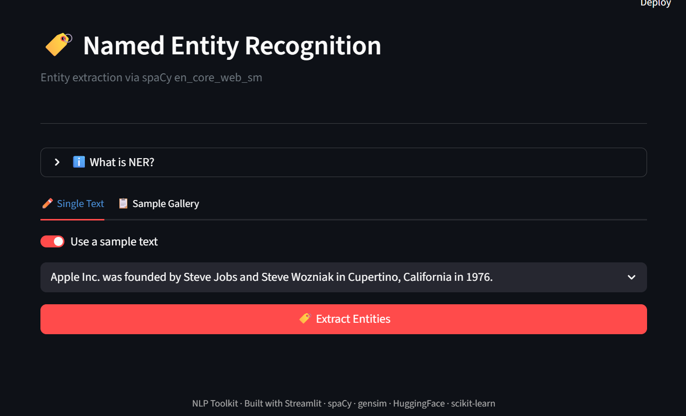
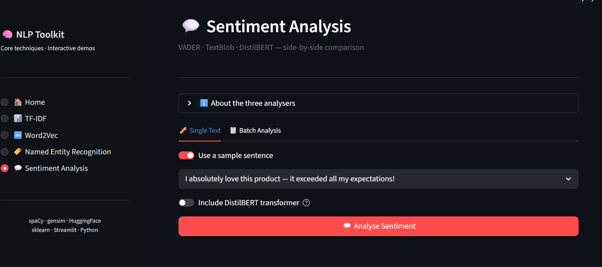

#  NLP Toolkit

> A production-quality, portfolio-ready Natural Language Processing toolkit implementing four core NLP techniques — with both a **CLI runner** and an **interactive Streamlit web UI** powered by a single shared backend.

---

##  Features

| Module | Technique | Libraries |
|--------|-----------|-----------|
|  **TF-IDF** | From-scratch + scikit-learn comparison | `scikit-learn`, pure Python |
|  **Word2Vec** | Skip-gram embeddings + PCA visualisation | `gensim`, `sklearn` PCA |
|  **NER** | Named Entity Recognition with colour highlighting | `spaCy` |
|  **Sentiment** | VADER · TextBlob · DistilBERT side-by-side | `nltk`, `textblob`, `transformers` |

**Architecture highlights:**
- Shared `src/` backend — zero duplicate logic between CLI and UI
-  All backend functions return structured `dict` / `pd.DataFrame` (no print statements)
-  Module-level caching for heavy models (spaCy, Word2Vec, HuggingFace)
-  Clean separation of concerns: `src/` = logic, `app.py` = UI, `main.py` = CLI

---

##  Screenshots

> *Add screenshots here after running `streamlit run app.py`*

| Home | TF-IDF | NER | Sentiment |
|------|--------|-----|-----------|
|  |  |  |  |
---

##  Tech Stack

- **Python 3.10+**
- **Streamlit** — interactive web UI
- **scikit-learn** — TF-IDF vectoriser, PCA
- **gensim** — Word2Vec skip-gram model
- **spaCy** — Named Entity Recognition (`en_core_web_sm`)
- **NLTK** — VADER sentiment analyser
- **TextBlob** — pattern-based sentiment
- **HuggingFace Transformers** — DistilBERT sentiment (SST-2)
- **matplotlib** — charts and PCA scatter plots
- **pandas / numpy** — data processing

---

## Getting Started

### 1. Clone & install

```bash
git clone https://github.com/yourname/nlp-toolkit.git
cd nlp-toolkit
pip install -r requirements.txt
python -m spacy download en_core_web_sm
```

### 2. Run the Streamlit web app

```bash
streamlit run app.py
```

Open [http://localhost:8501](http://localhost:8501) in your browser.

### 3. Run the CLI

```bash
# Run all four modules
python main.py

# Run a single module
python main.py --module tfidf
python main.py --module word2vec --word queen
python main.py --module ner --text "Apple was founded by Steve Jobs in California."
python main.py --module sentiment --text "I absolutely love this!"

# Skip the HuggingFace model (offline or low-RAM environments)
python main.py --skip-transformer
```

---

##  Folder Structure

```
nlp-toolkit/
│
├── app.py              # Streamlit web UI (presentation layer only)
├── main.py             # CLI runner (presentation layer only)
├── requirements.txt
├── README.md
│
├── src/                # Shared backend — used by BOTH app.py and main.py
│   ├── __init__.py     # Exposes run_tfidf, run_word2vec, run_ner, run_sentiment
│   ├── tfidf.py        # TF-IDF (scratch + sklearn)
│   ├── word2vec.py     # Word2Vec (gensim) + PCA
│   ├── ner.py          # Named Entity Recognition (spaCy)
│   ├── sentiment.py    # Sentiment analysis (VADER + TextBlob + DistilBERT)
│   └── utils.py        # Text preprocessing, sample data, display helpers
│
├── data/               # Place custom .txt / .csv corpora here
└── notebooks/          # Jupyter exploration notebooks
```

---

## 🔌 Backend API

Every module exposes a **master entry point** callable from any context:

```python
from src.tfidf     import run_tfidf
from src.word2vec  import run_word2vec
from src.ner       import run_ner
from src.sentiment import run_sentiment

# TF-IDF — returns dict with 'scratch' and 'sklearn' DataFrames
result = run_tfidf(["Machine learning is great.", "NLP is fascinating."])

# Word2Vec — returns dict with similarity DataFrame and PCA data
result = run_word2vec("king", topn=8)

# NER — returns dict with entities_df and highlighted HTML
result = run_ner("Apple was founded by Steve Jobs in Cupertino, California.")

# Sentiment — returns dict with vader, textblob, transformer results
result = run_sentiment("I love this product!", use_transformer=False)
```

---

##  Module Details

### TF-IDF
Two implementations compared side by side:
- **Scratch**: raw TF × smoothed IDF (formula-transparent, educational)
- **sklearn**: `TfidfVectorizer` with `sublinear_tf=True` (production-grade)

### Word2Vec
- **Architecture**: skip-gram (sg=1) trained on a built-in 23-sentence corpus
- **Similarity**: cosine distance via `model.wv.most_similar()`
- **Visualisation**: PCA projection to 2-D with semantic cluster colouring

### Named Entity Recognition
- **Model**: `en_core_web_sm` — fast, lightweight (~12 MB)
- **Output**: entity text, label, character offsets + colour-highlighted HTML
- **18 entity types**: PERSON, ORG, GPE, DATE, MONEY, and more

### Sentiment Analysis
Three approaches, uniform output format:
- **VADER**: rule-based compound score (best for informal text)
- **TextBlob**: polarity + subjectivity (general prose)
- **DistilBERT**: transformer confidence (highest accuracy, ~260 MB download)

---

##  Future Improvements

- [ ] Upload custom `.txt` / `.csv` corpora via Streamlit file uploader
- [ ] Add `en_core_web_lg` / `en_core_web_trf` model selector for NER
- [ ] Support multilingual NER (spaCy `xx_ent_wiki_sm`)
- [ ] Add topic modelling (LDA via `gensim`)
- [ ] Export results to CSV / JSON from the UI
- [ ] Docker container for one-command deployment
- [ ] Unit tests for all `src/` modules

---

## 📄 License

MIT — free to use, modify, and distribute.

---

*Built with ❤️ using Python, Streamlit, spaCy, gensim, and HuggingFace Transformers.*
